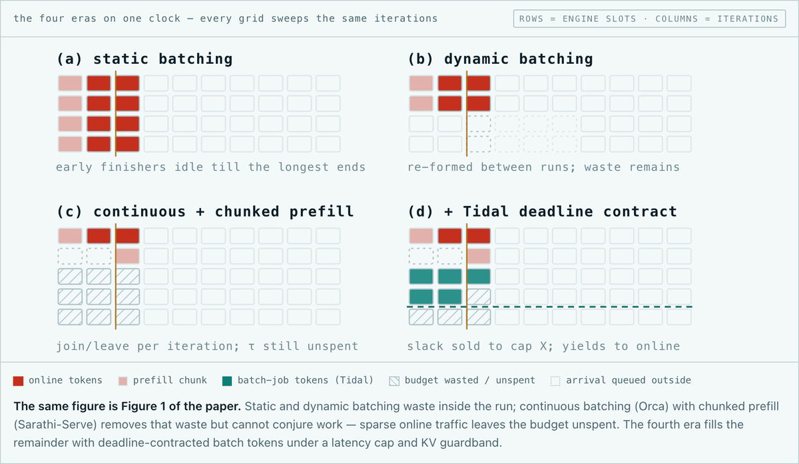
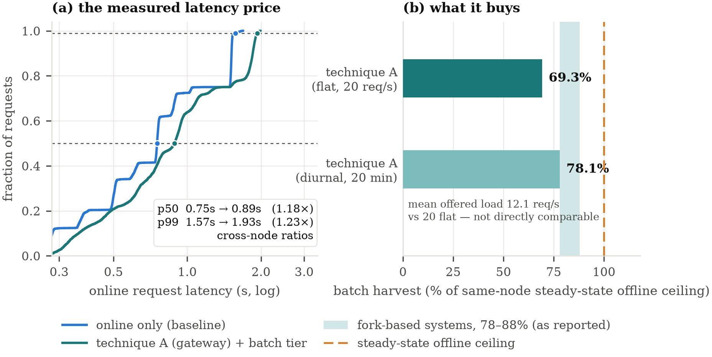

# Tidal 🌊

[](https://doi.org/10.5281/zenodo.22076918)

**Co-serving online and batch LLM traffic on one GPU.** Tidal adds an
OpenAI-compatible Batch API (`/v1/batches`, 24-hour window, half price) to an
unmodified vLLM node, and fills the spare token budget each scheduler iteration
leaves unspent with deadline-contracted batch work — without pushing your online
latency past a bound you set.

> A node serving only chat traffic emits about a third of the tokens per second
> it sustains when saturated. That headroom can't be banked — it perishes every
> iteration. Tidal sells it.

Paper: **[Tidal: Co-Serving Online and Batch LLM Traffic under Deadline Contracts](https://doi.org/10.5281/zenodo.22076918)** (v2.4).
Interactive write-up with all the animations: **[rajagurunath.github.io/tidal](https://rajagurunath.github.io/tidal/)**.

## How serving learned to batch, and where Tidal sits



Each generation of batching widened what may share one engine iteration: first
requests of different lengths, then requests in different phases. Tidal widens it
once more — to two different *products*, online and batch, on the same iteration.

## The result



On RTX A6000 nodes serving Qwen2.5-7B, the gateway recovers **69.3%** of the
node's steady-state offline ceiling under a flat 20 req/s online load (**78.1%**
under a diurnal trace), while online request latency holds at **1.18× / 1.23×**
the median / p99 of a matched online-only node.

## Two techniques, one repo

| | Technique A — Gateway | Technique B — TidalScheduler |
|---|---|---|
| Where policy lives | Sidecar process (external control) | Inside the engine (`--scheduler-cls`) |
| vLLM requirement | Stock, `--scheduling-policy priority` | Latest main, plugin subclass |
| Batch admission | AIMD watermarks on `/metrics` (1 Hz) | Per-iteration token-budget packing with a self-calibrating interference model |
| 24h SLA | Laxity-driven priority escalation (LLF) | Same, plus KV guardband + cheap-victim preemption |

Both give you: durable OpenAI-wire `/v1/files` + `/v1/batches`, crash-safe
SQLite/Postgres storage, laxity-based deadline guarantees, and metering at a 50%
batch discount. The [paper](docs/paper/) compares them head-to-head.

The scheduling signal is **laxity** — how much time a job can still afford to
lose before its deadline is at risk. A batch draining fast enough never escalates;
one falling behind climbs on its own, early, without dragging every other batch
with it. (Animated on the [project site](https://rajagurunath.github.io/tidal/).)

## Quickstart

```bash
uv venv && uv pip install -e ".[dev]"
vllm serve Qwen/Qwen2.5-0.5B-Instruct --scheduling-policy priority   # terminal 1
tidal serve                                                          # terminal 2
```

Then use any OpenAI SDK against the gateway:

```python
from openai import OpenAI
client = OpenAI(base_url="http://127.0.0.1:8080/v1", api_key="tidal-dev-key")
f = client.files.create(file=open("requests.jsonl", "rb"), purpose="batch")
b = client.batches.create(input_file_id=f.id, endpoint="/v1/chat/completions",
                          completion_window="24h")
```

Technique B: add `--scheduler-cls tidal.engine.scheduler.TidalScheduler` to `vllm serve`.

## Status

Alpha, under active development. Design docs in [`docs/plans/`](docs/plans/);
paper and evidence in [`docs/paper/`](docs/paper/); the KV-lease research
direction in [`docs/research/`](docs/research/).

Known limitations:

- **One dispatcher per store.** There is no ownership lease, so nothing stops a
  second `tidal serve` from running a tick loop against the same database. The
  store makes that safe for *data*: item claims are a single atomic
  `UPDATE ... RETURNING`, terminal item transitions are idempotent (a duplicate
  or late result never drifts `request_counts`), and attaching result files is a
  first-writer-wins claim. It is not safe for *work*: both processes would submit
  items, meter their own successes, and run independent AIMD targets against one
  GPU. Run exactly one dispatcher until a lease exists.
- **The default API key is a placeholder.** `tidal serve` warns loudly if it
  binds to a non-loopback address while `TIDAL_API_KEY` is still `tidal-dev-key`.
  Set a real secret before exposing the gateway.

## GPU deployment

The paper's numbers come from a deliberately modest testbed. [`deploy/`](deploy/)
is the kit for taking Tidal to a real GPU on io.net CaaS: a vLLM image with
Tidal baked in (`SCHEDULER_MODE=stock|tidal` picks the technique), a slim gateway
image, a GPU compose file, a CaaS deploy payload template, and `run_gpu_eval.sh`
— an unattended, resumable run of the full A/B matrix plus diurnal and
deadline-stress cases that tars its own results.

Start with the runbook: **[`deploy/README.md`](deploy/README.md)**. Read the vLLM
version-pin caveat and run the 10-minute compat canary before trusting any
technique-B measurement.

## Companion project

[LazyCode](https://github.com/rajagurunath/lazycode) is the client side — a
coding agent that compiles backlog work into batch jobs and runs them on a tier
exactly like this one.

## License

Apache-2.0.
